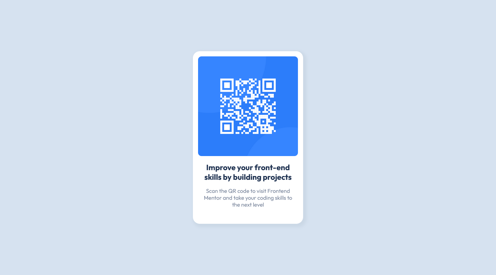

# Frontend Mentor - QR code component solution

This is a solution to the [QR code component challenge on Frontend Mentor](https://www.frontendmentor.io/challenges/qr-code-component-iux_sIO_H). Frontend Mentor challenges help you improve your coding skills by building realistic projects. 

## Table of contents

- [Overview](#overview)
  - [Screenshot](#screenshot)
  - [Links](#links)
- [My process](#my-process)
  - [Built with](#built-with)
  - [What I learned](#what-i-learned)
  - [Useful resources](#useful-resources)
- [Author](#author)

## Overview

### Screenshot

### Links

- Solution URL: [Add solution URL here](https://your-solution-url.com)
- Live Site URL: [Add live site URL here](https://your-live-site-url.com)

## My process

### Built with

- HTML5
- CSS Flexbox

### What I learned

While writing this project, i learned basics of box model, flexbox, CSS units and how to add fonts from file.

### Useful resources

- [MDN Web Docs](https://developer.mozilla.org/en-US/docs/Web/CSS)

## Author

- Website - [nextcorp](https://nextcorp.github.io/)
- Frontend Mentor - [@nextcorp](https://www.frontendmentor.io/profile/nextcorp)

